# clip
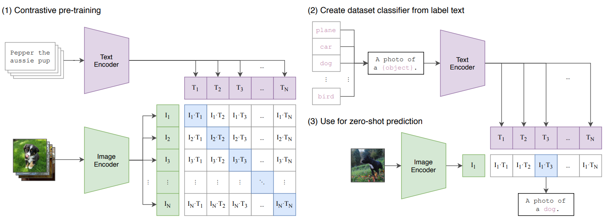
用自然语言监督信号训练视觉模型
## train
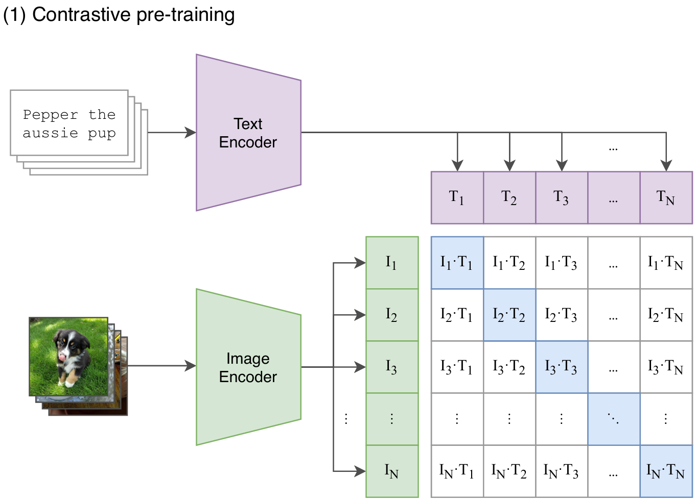
### 对比学习
预测一张图片的字幕可能有很多结果，约束太大。
用对比学习来效率会提高。
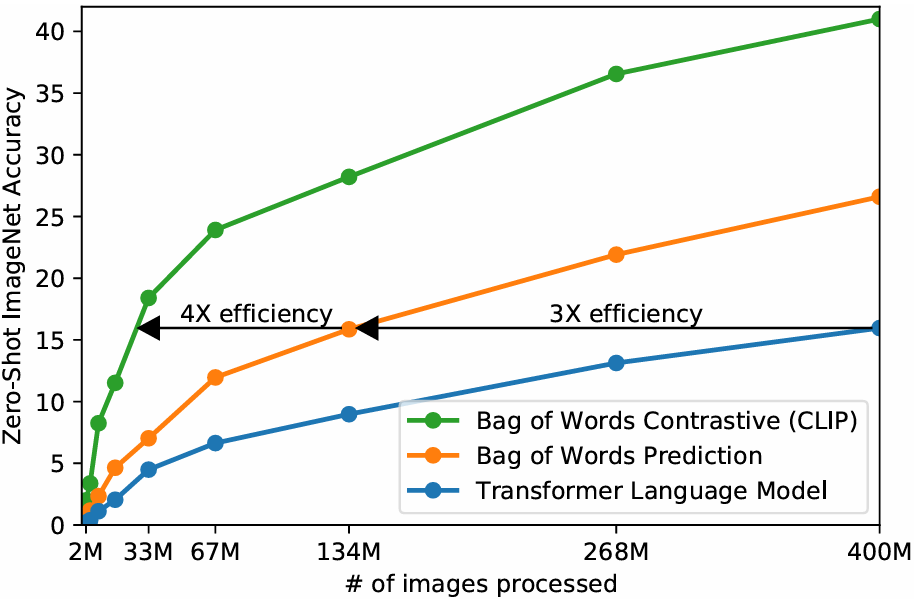
### 伪代码
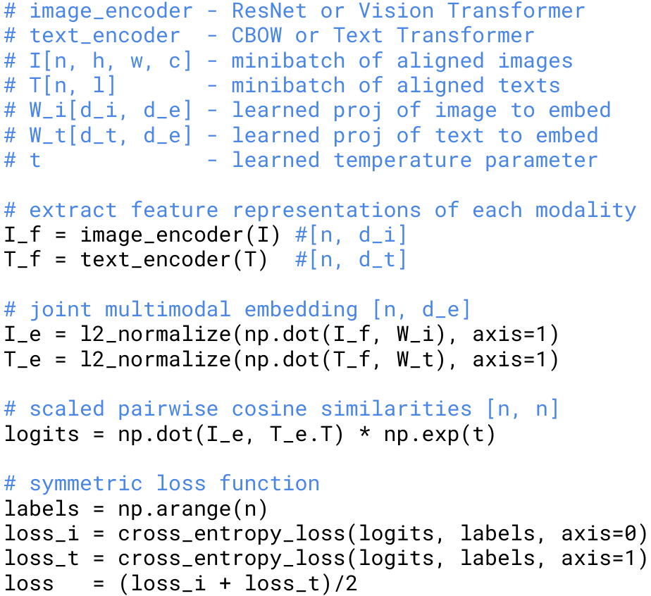
## inference
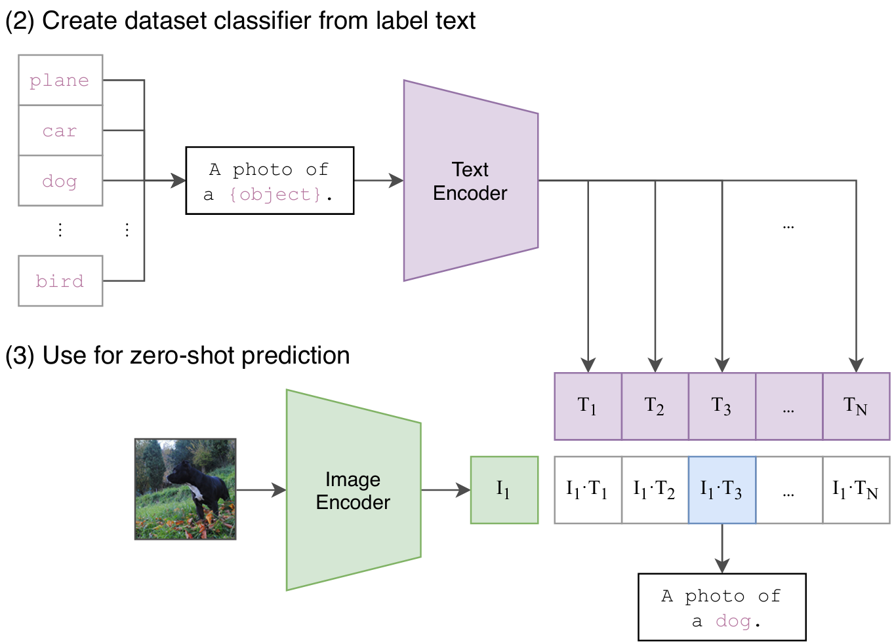
对于分类任务，为每一个标签生成一句话，过text encoder得到特征。将文本特征和图像特征算相似度，取最相似的作为预测结果。
## prompt 
标签为何要转成一句话？ 1.多义性 2.避免distribution gap
使用多个模版，综合结果。
## limitation
1. 和最好模型比起来不够好。
2. 在一些数据集上甚至不如baseline，在很多领域都是瞎猜。
3. out of distribution 效果非常差。
4. 生成式或许是未来。
5. 数据利用不够高效。
6. 因为训练数据集和测试数据集的原因，所以调整超参数时已经有先验知识了。
7. 模型里隐藏了偏见。
8. 一些任务few shot甚至不如zero shot。

# other work
## segmentation
### Lseg
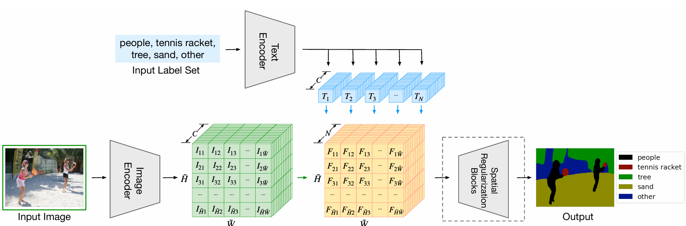
实际是有监督学习，只是将文本特征和图像特征结合在一起。
### GroupVit
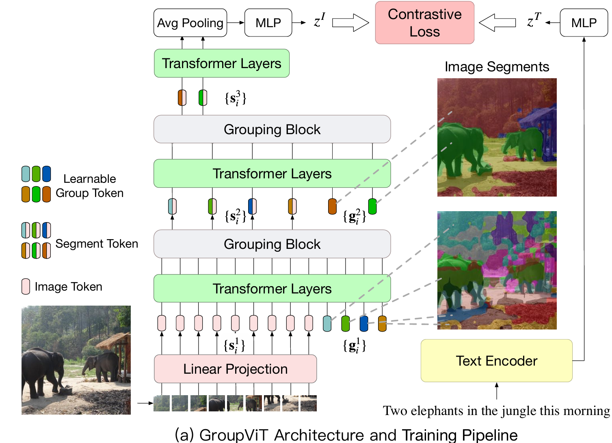
Grouping:从中心点扩散（类似聚类）得到分割结果
Group Token：类似cls Token，可以当作起始聚类点，64个。
经过6层Transformer层，过Gruoping Block
Grouping Block：将patch embedding assign 到Group Token上去，类似cluster，所以过这层后只剩64个Token
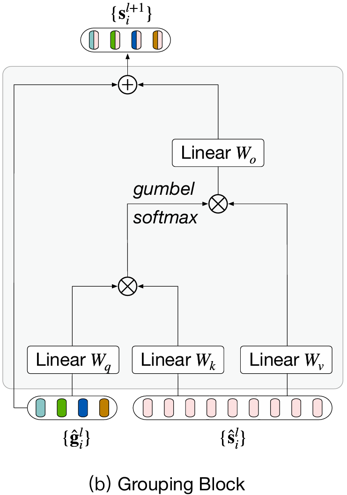
再加新的GroupToken继续进行合并
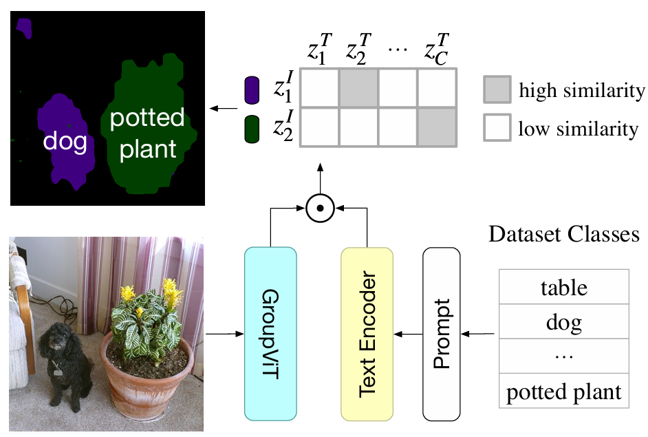
推理时和clip一样算相似度。
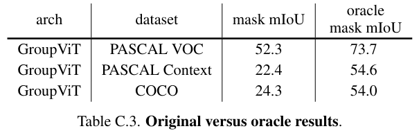
GroupVit已经分割的很好了，但是最后分类时错了，因为clip只能学到明确的语义信息。

## Object Detection
### ViLD
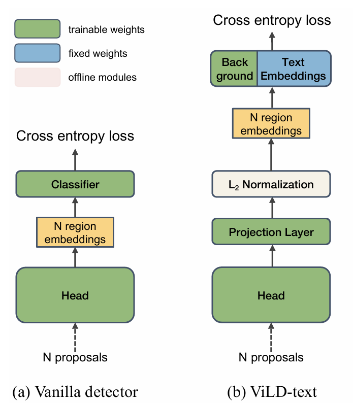
a.原本的网络
b.只是在分类的时候算相似度
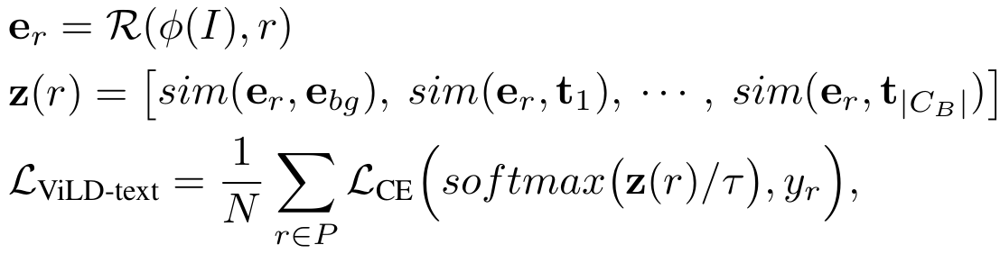
$I$是图像，$\varPhi(I)$是抽取的图像特征，$r$是bounding box，$e_r$是region embedding，$z(r)$是算的图像文本相似度。
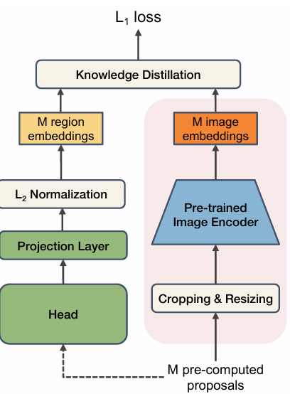
想要将region embedding和clip的特征相匹配，所以直接做蒸馏。
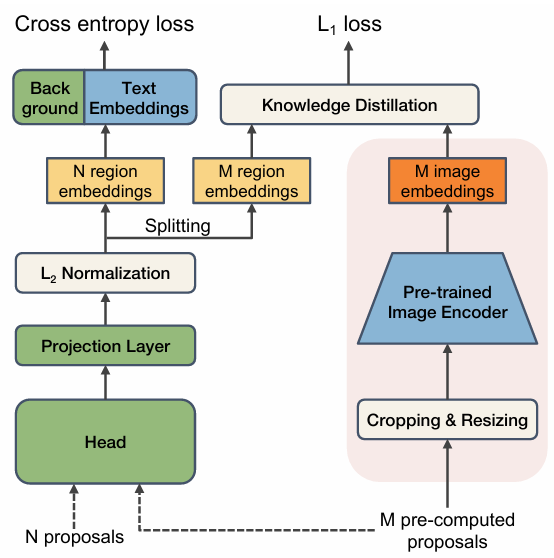
将ViLD-text和ViLD-image合体即可。

### Glip
将detection和phrase groud合并成一个统一框架。
可以运用两个领域的数据。
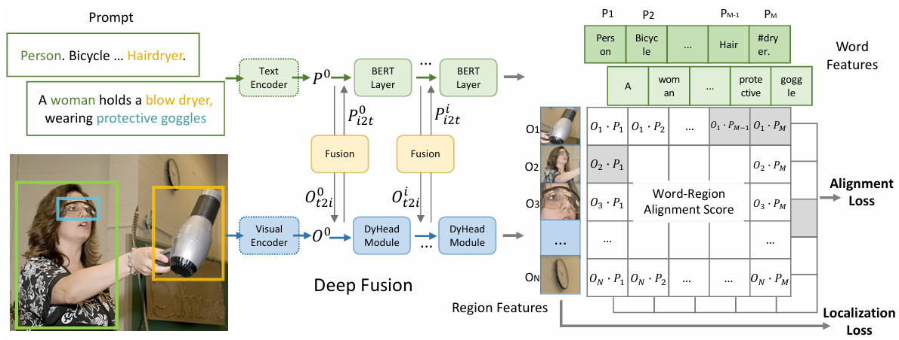
### GlipV2
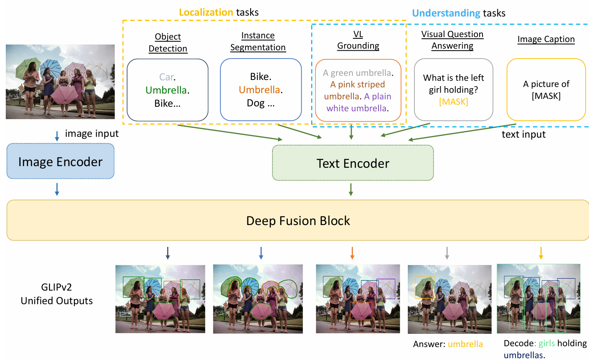
实际就是在text Encoder上做文章，使得能进行更多的任务。

## Graphics
### CliPasso
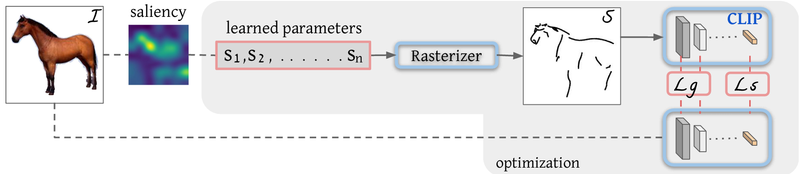
生成贝赛曲线（4个点）来画简笔画，通过曲线可以生成图像，这个过程可导。损失有两个：
1. 简笔画特征和原始图像语义特征接近（语义损失Ls），直接将原图和简笔画送到clip里出特征算相似。 
2. 图像尽可能相近（图形损失Lg），提取clip前几层的特征算相似。
  
初始化用ViT最后一层算平均，然后再权重大的上采点。

## Video
### clip4clip
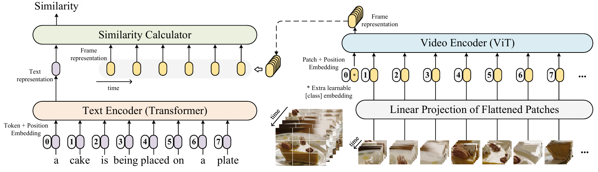
问题在于如何将一个文本特征和多帧的图像特征匹配。

1. 最简单最常用的方法是对所有帧直接取平均。
2. 扔给LSTM得到一个特征。或者加上时间编码，扔给Transformer得到一个特征。
3. 将文本特征（类似cls token）和图像特征一起扔给Transformer。
### ActionClip
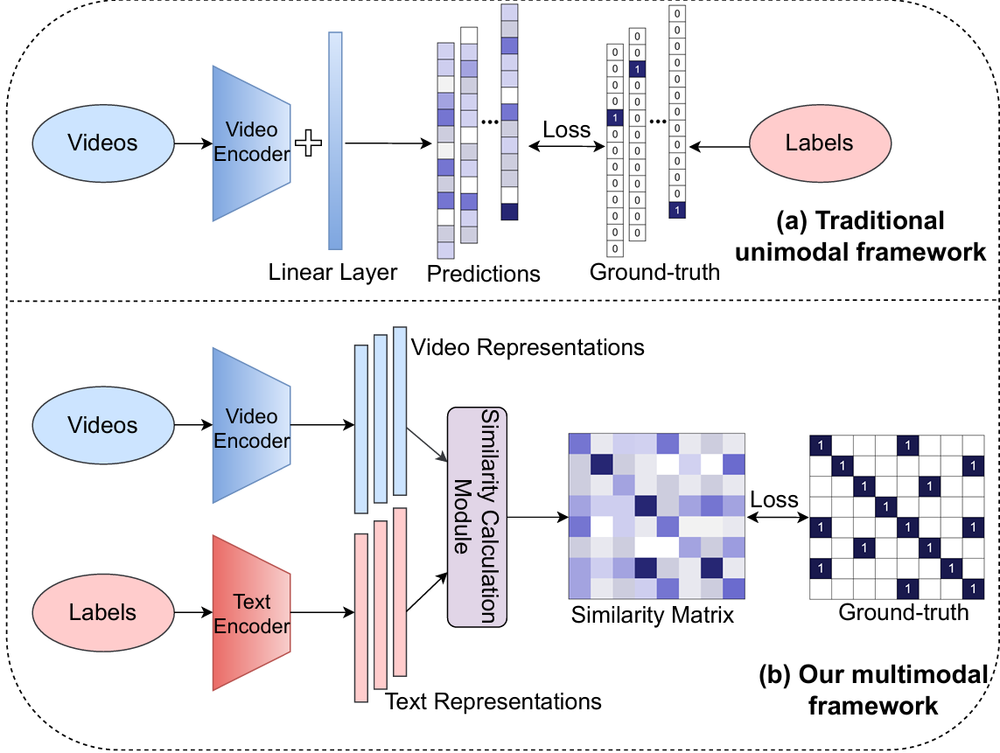
类似clip，就是最后的正负样本矩阵不是对角了。
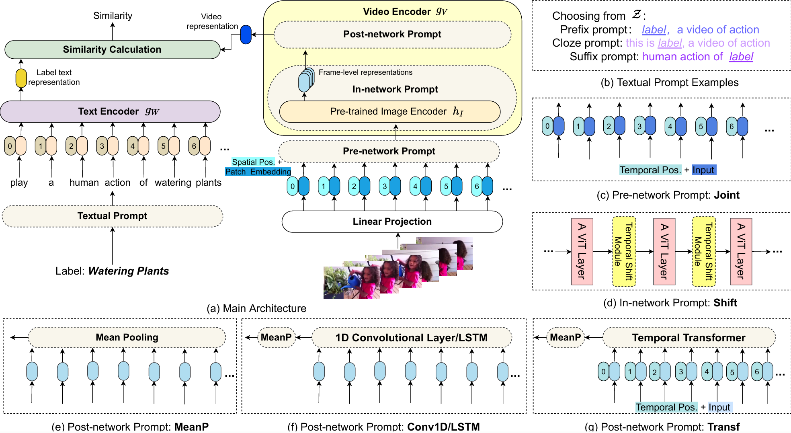
## Audio
### AudioClip
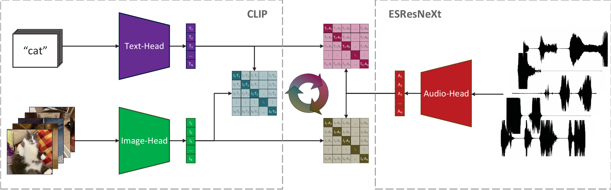