# 3维成像
## 摄像机成像原理
### 摄像机平面到成像平面
$P=[x,y,z]->P'=[x',y']$  
$x'=f\frac{x}{z},y'=f\frac{y}{z}$  
透镜折射定律$f=\frac{R}{2(n-1)}$，透镜焦距
### 透镜产生畸变
枕形失真和桶形失真
### 成像平面到像素平面
1. 偏置
   $(x',y')->(x'+c_x,y'+c_y)$
2. 单位变换
   $f:m\:->k,l:pixel/m,(x,y,z)->(fk\frac{x}{z}+c_x,fl\frac{y}{z}+c_y)$
3. 线性变换
   令$\alpha=fk,\beta=fl$
   $P->P'$的变换不是线性变换
### 齐次坐标
普通转齐次：$(x,y)->(x,y,1),(x,y,z)->(x,y,z,1)$  
齐次转普通：$(x,y,w)->(x/w,y/w),(x,y,z,w)->(x/w,y/w,z/w)$  
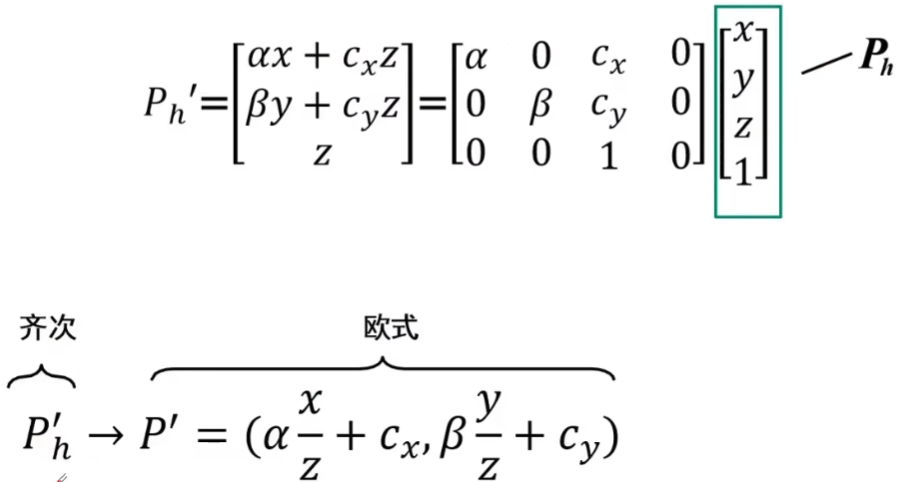
$P_h->P_h^{'}$是线性变换，变换矩阵$M$是相机固有参数
### 摄像机偏移
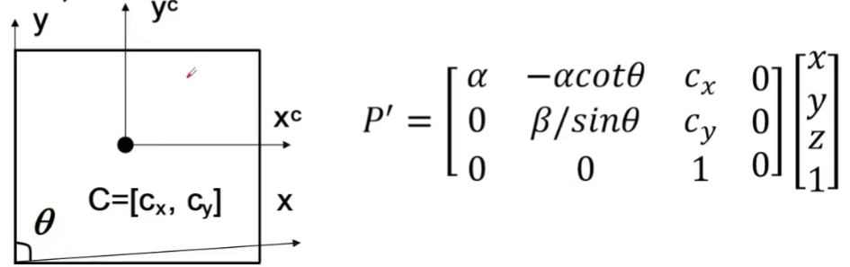
$M=K[I\quad 0]$，摄像机内参矩阵$K$为投影矩阵$M$去掉第四列零向量  
$K$有5个参数可变，即自由度为5
### 世界坐标系到相机坐标系
$P=\begin{bmatrix}R&T\\0&1\\\end{bmatrix}P_w,P_w=\begin{bmatrix}x_w\\y_w\\z_w\\1\end{bmatrix}$  
世界坐标系通过$R,T$旋转、平移得到相机坐标系  
$P'=K[R\quad T]P_w=MP_w$,$[R\quad T]$为外参数矩阵
### Summary
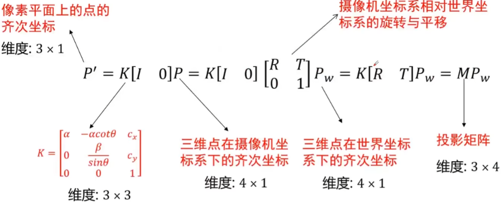
$M(dim:3\times 4)$有11个自由度，内参5个，外参6个
### Theorem
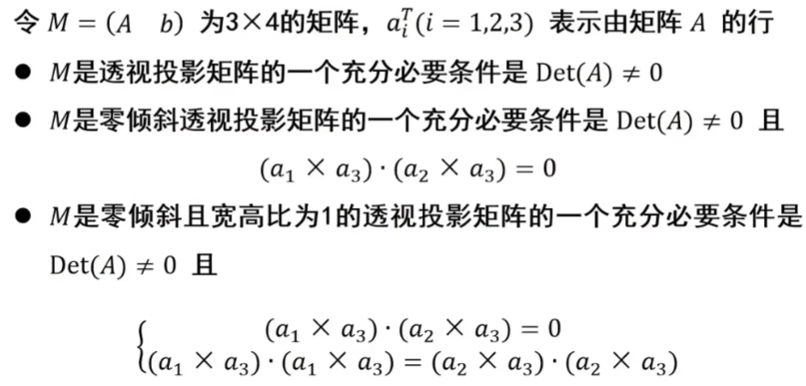

## 摄像机标定
### 棋盘格标定
立方体构建世界坐标系，最少6对点来解方程，为了鲁棒性，会大于6对点。取的点不能位于同一平面，如果同一平面就退化了，解不出方程。
### 参数求解
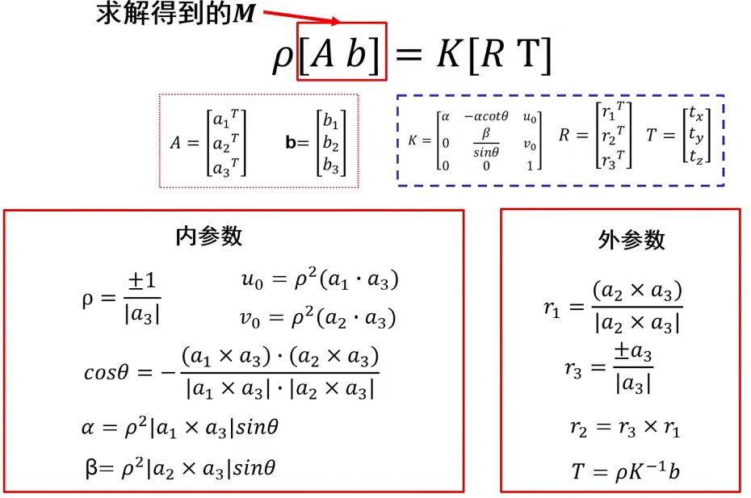
### 畸变
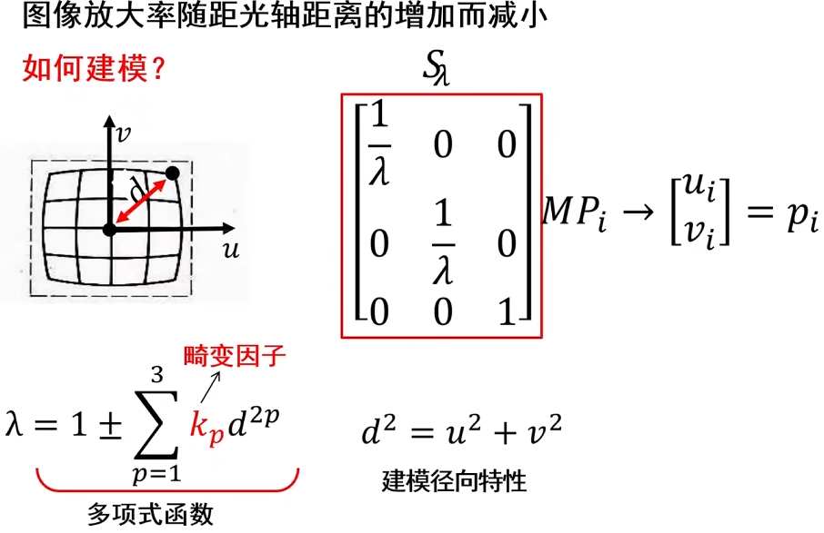
### Transformation
#### 2D欧式变换
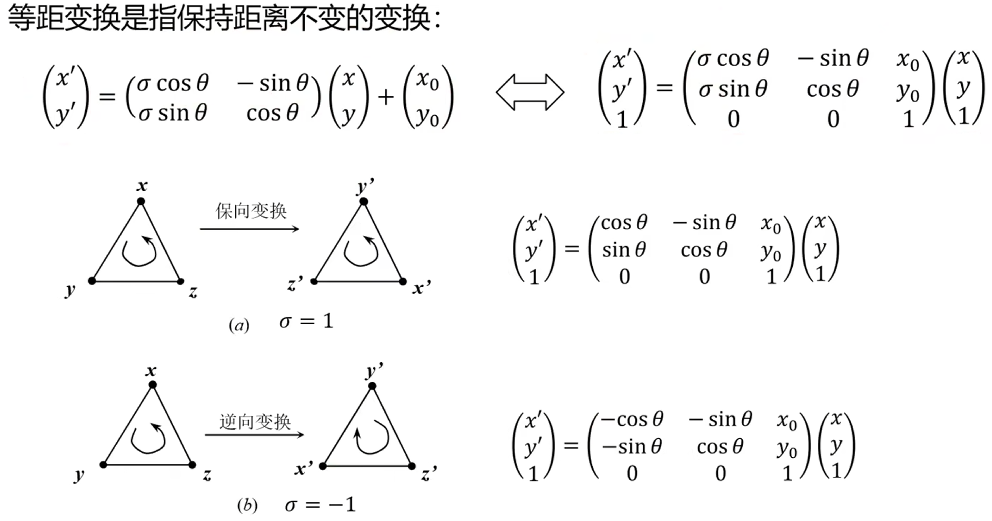
等距变换即$D(a,b)=D(a',b')$，变换前后两点距离相等。
当$\sigma=1$时也叫欧式变换  

#### 仿射变换
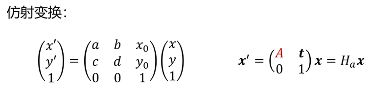
性质
仿射变换的核心性质决定了其适用场景，主要包括：
1. 保持平行性：变换前的平行线，变换后仍为平行线（这是仿射变换与 “投影变换” 的最大区别，投影变换会让平行线相交）；
2. 保持共线性：变换前共线的点（在同一直线上），变换后仍共线；
保持线段比例：若点 B 是线段 AC 的中点（AB:BC=1:1），变换后点 B' 仍是 A'C' 的中点（A'B':B'C'=1:1）；
3. 不保持度量属性：长度、角度、面积可能改变（仅特殊仿射变换如 “旋转”“反射” 保持这些属性）。
#### 透视变换
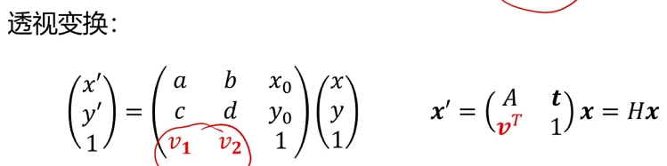
性质
透视变换打破了仿射变换的 “平行性” 约束，其关键性质如下：
1. 仅保持共线性：变换前共线的点（在同一直线上），变换后仍共线；但平行线可能变为相交线（如铁路轨道在远处 “交汇”）。
2. 不保持线段比例：若点 B 是线段 AC 的中点（AB:BC=1:1），变换后 B' 可能不再是 A'C' 的中点（如远处的线段看起来更短）。
3. 模拟透视效应：能还原 “远小近大” 的视觉规律，例如将倾斜拍摄的矩形（如桌面、文档）矫正为正矩形。
4. 可逆性：若透视变换矩阵可逆（行列式不为 0），则存在逆变换，可将矫正后的图像还原为原始透视畸变图像。  

#### 三维欧式变换
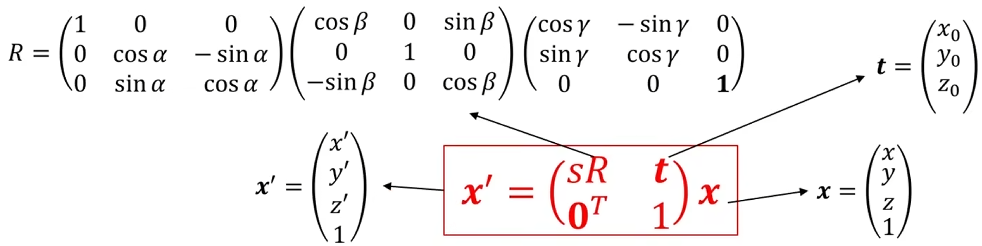
## 单视图几何
### 2D
点$x(x1,x2,1)$在直线$l:ax_1+bx_2+c=0$等价于$l=[a,b,c],x=[x1,x2,1],x^Tl=0$。  
两条直线的交点$x$满足$x^Tl_1=0,x^Tl_2=0$,所以$x=l_1\times l_2$。  
$x:[x_1,x_2,0]$为无穷远点，$l_{\infty}:[0,0,1]$为无穷远线。
### 3D
点$x(x_1,x_2,x_3,1)$在面$\pi:[a,b,c,d]$上等价于$x^T\pi=0$。
直线只考虑方向$d=[a,b,c]$,无穷远点$x_{\infty}=[a,b,c,0]$，平行平面在无穷远处交于一条公共线无穷远直线，无穷远直线在无穷远面$\pi_{\infty}=[0,0,0,1]$上。
### 无穷远点变换
透视变换后不再是无穷远点，仿射变换后是无穷远点。无穷远线同理。
$l'=H^{-T}l,x'=Hx$
三维空间中的无穷远点在图像平面上的投影点称为影消点。
$v=Kd,d=\frac{K^{-1}v}{||K^{-1}v||}$，$v$为影消点，$K$为相机内参数，$d$为直线方向。
影消线$l_{horizen}=H_p^{-T}l_{\infty}$
$n=K^Tl_h$，$n$为平面法向量，$K$为相机内参，$l_h$为影消线。
### Calculation
#### 两组平行线的夹角与影消点
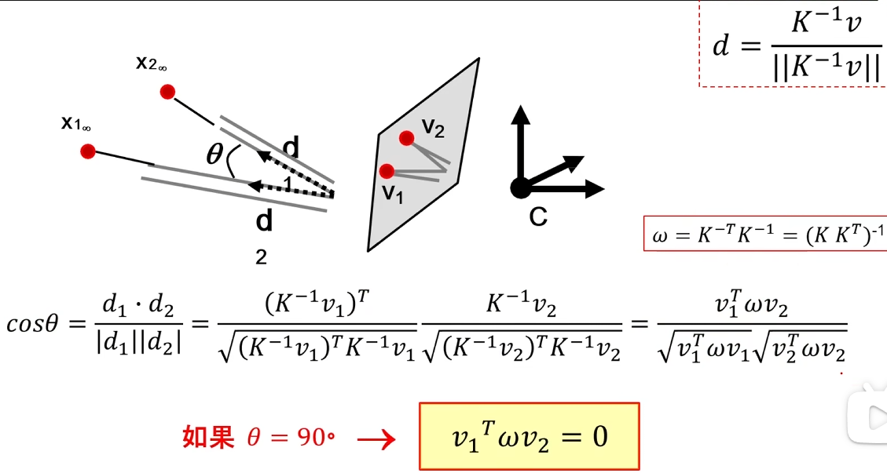
#### 单视图重建
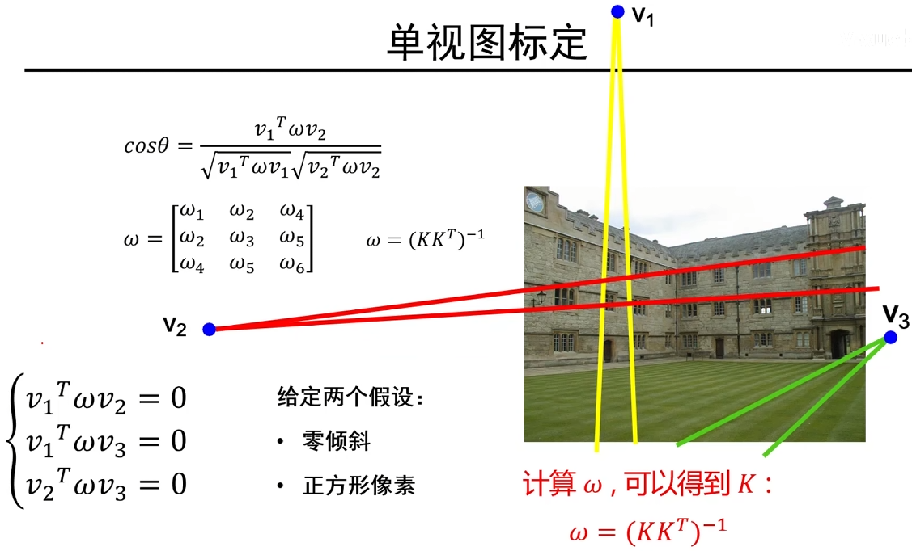
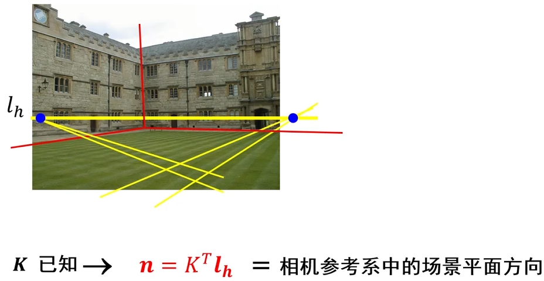
缺点：只是真实场景的等比例重建，而且需要先验信息。
## 双视图
### 三角化
线性解，最小二乘
非线性解，最小化$d(p,MP)+d(p',M'P)$
### 极几何
已知一个图像中的$p$点，如何在另一张图中找到$p'$
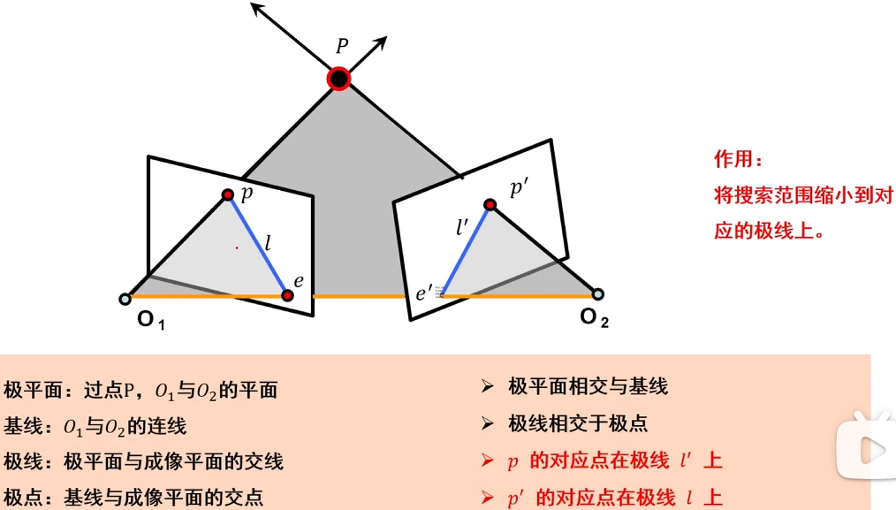
#### 本质矩阵
本质矩阵对规范化摄像机拍摄的两个视点图像间的极几何关系进行描述
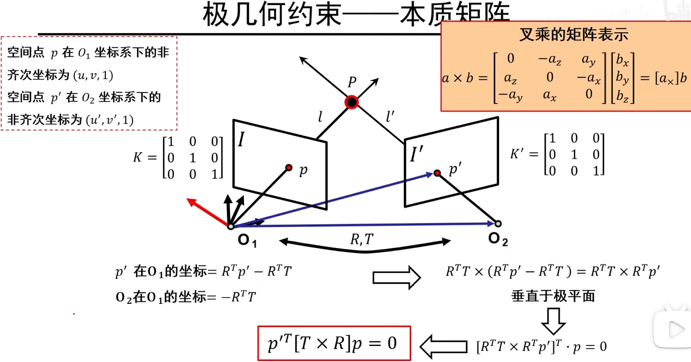
本质矩阵$E=T\times R$，则有$p'^TEp=0$
#### 基础矩阵
变换到规范化相机，$p_c=K^{-1}p$,带入本质矩阵可得：
基础矩阵$F=K'^{-T}[T\times R]K^{-1}$，$p'^TFp=0$
### 基础矩阵估计
通过点对关系估计基础矩阵，从基础矩阵得到相机内外参数。
八点算法（精度低），最小二乘估计出$F'$,将$F'$进行奇异值分解，将第三个奇异值变为0。
归一化八点法，计算$T\:T',q_i=Tp_i,q'_i=T'p'_i,F=T'^TF_qT$
### 单应矩阵
所有点在同一个平面上，有结论：
$p=Hp'$
$H=K'(R+tn_d^T)K^{-1},n_d=\frac{n}{d}$,$d$为第一个相机坐标远点到平面$\pi$的距离，$K$为第一个相机的内参，$R,T$为第二个相机相对第一个相机的位置，平面$\pi:n^TP=d$.