# 多模态
[课程](https://www.bilibili.com/video/BV1fA411Z772?spm_id_from=333.788.videopod.sections&vd_source=2ff6d59fda407ffeac6c6a050a2935db)
## ViLT
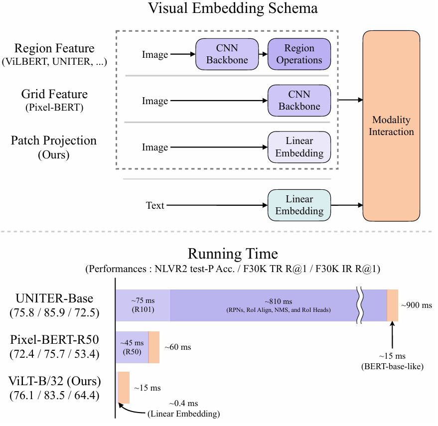
之前的工作都是想办法加强视觉编码器，比如用目标检测的backbone或者用cnn抽出来的最后的特征，这些在计算上比文本花费时间长很多。所以想要将视觉特征的抽取也用抽文本特征的方法（借鉴ViT）。
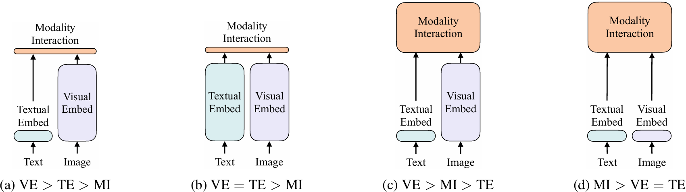
VE抽图像的时间，TE抽文本的时间，MI特征融合的时间。
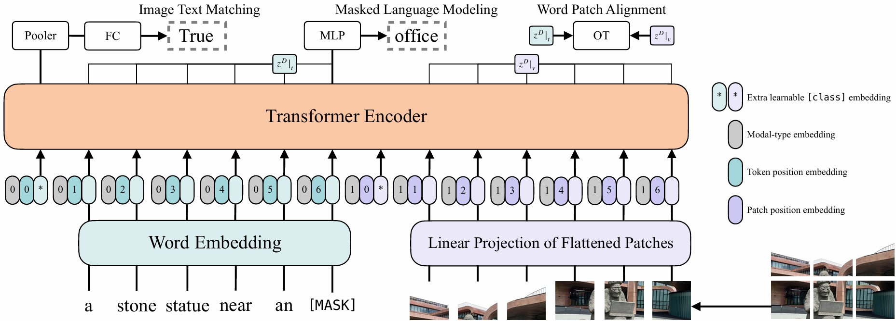
损失
1. Image Text Matching：用第一个token(1&times;h)过matrix(h&times;h)然后再过Fc做二分类算loss（对比学习）
2. 将图像特征和文本特征当作了概率分布，计算两个分布之间的距离。
3. 针对文本设计完型填空loss。
小技巧：
1. 整个词mask掉，而不是单个token，避免只靠文本特征由前后token猜出来。
2. 图像增强
   
## ALBEF
insight：视觉编码器应该比文本编码器大，所以直接将文本的大模型劈开，一半做编码，一半做融合。
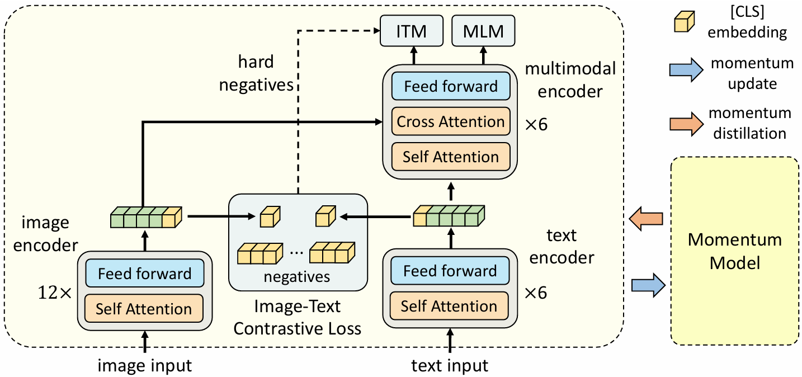
### loss：
***1. ITC loss：在图像和文本都抽一个cls token
2. ITM loss：判断I和T是不是一对。但因为负样本太多，分类器会过快收敛，所以负样本选择要有限制。这篇通过某种方式选择最难的负样本（最接近正样本的负样本）。取batch中其他的所有文本和图片算相似度，选最像的。
3. MLM loss：完型填空
***
### momentum distillation
为了消除noisy web data，因为负样本可能也能很好地描述图片，或者正样本不能很好地描述图片。所以用新模型的输出来加loss。
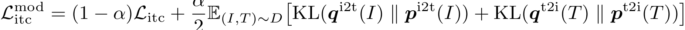
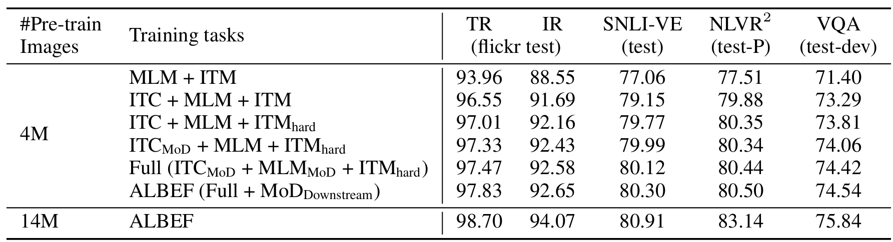

## VLmo
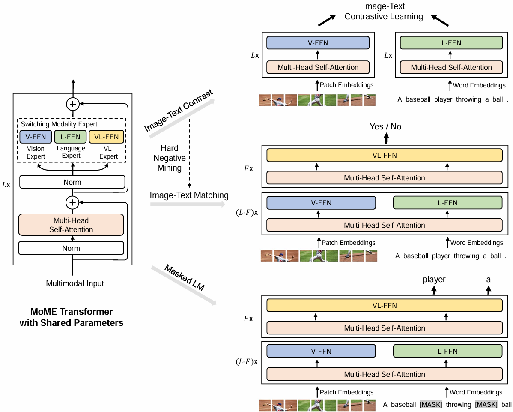
灵活，训练可以使用单独领域的数据进行训练。
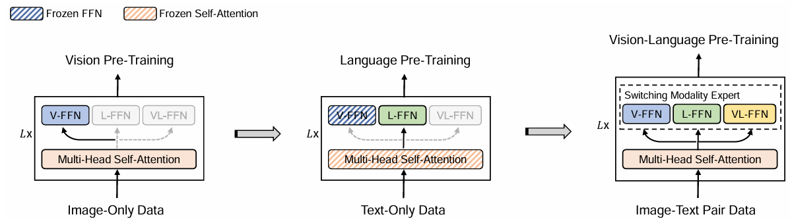
先视觉然后冻住训语言效果好，但是先语言然后冻住attention训视觉效果不好。
***attention层在各个模态间可以共享参数。***

## Blip
### motivation
模型角度：主流是encoder-base 和 encoder-decoder
数据角度：大规模noisy数据集上训练，怎么区clean dataset，训练captioner和Filter
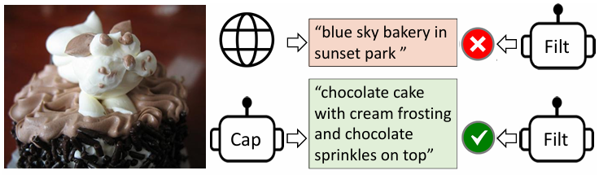
### model
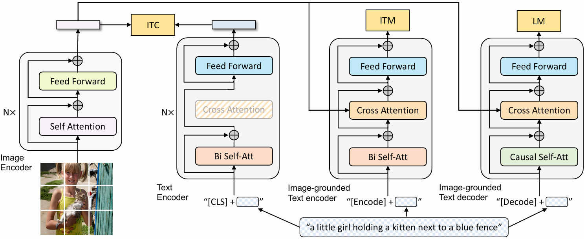
图像标准ViT，文本有三个编码器，分别是处理ITC、ITM、LM的loss，LM就可以用来generate text。MLM是完形填空，LM是预测下一个词。
### captioner and filter
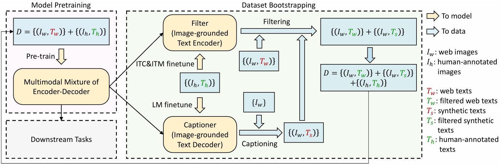
Filter就是ITC&ITM模型用$(I_h,T_h)$finetune，Captioner就是LM模型用$(I_h,T_h)$finetune。
经过Captioner和Filter就可以得到新的比较clean的数据集，再用这个数据集去训，提升非常显著。
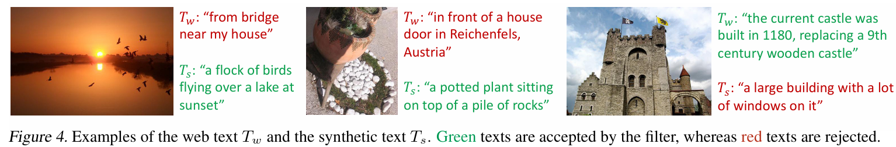
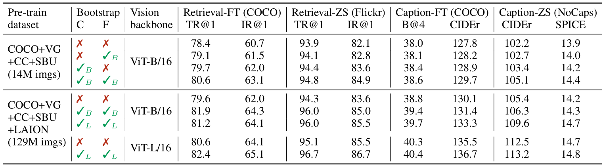
### 应用
用BLIP去生成caption去finetune stable-diffusion
用BLIP去优化多模态的数据集，用BLIP生成，用CLIP选择。

## CoCa

为了解决训练效率问题，每次训练只用forward一次。

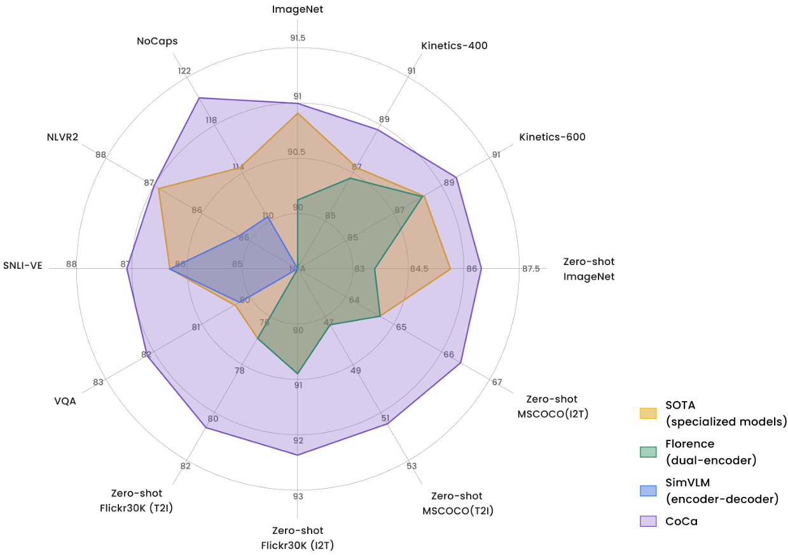
一种非常好的画图方式。

## BEiT
因为图像和文本过来Transformer后都是token，所以本质没有区别。
***统一使用LM loss***
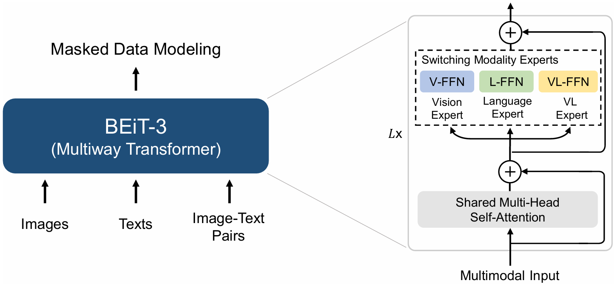
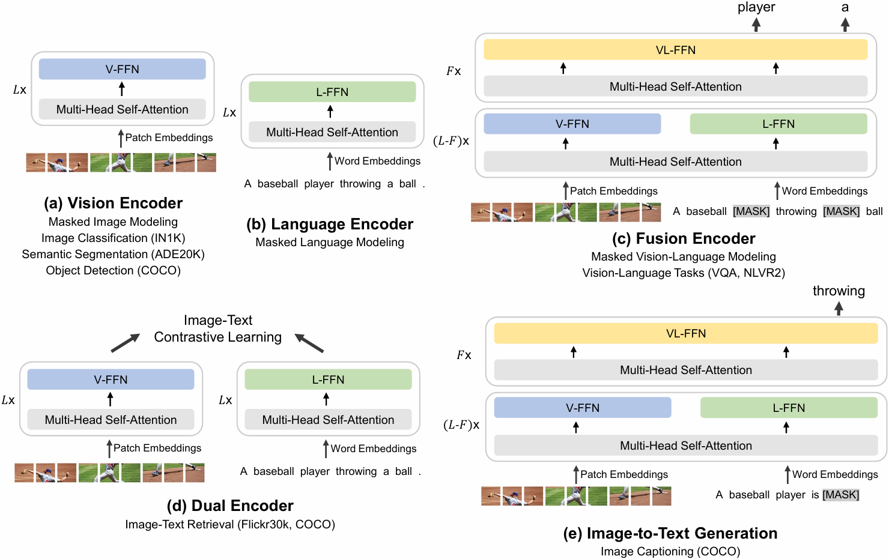
可以适应多种任务，不需要为下游任务改变模型。

## Summary
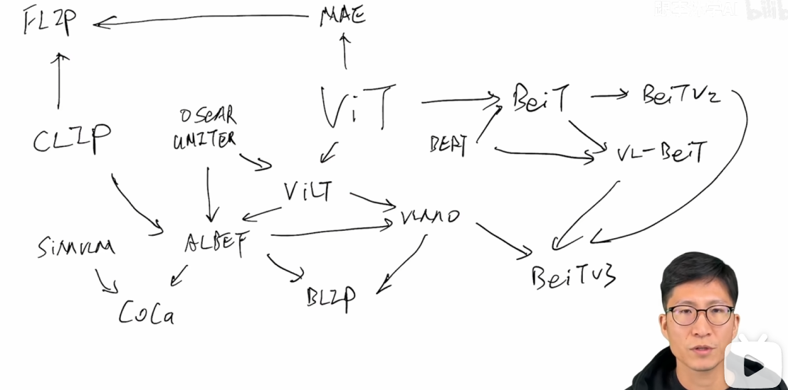
