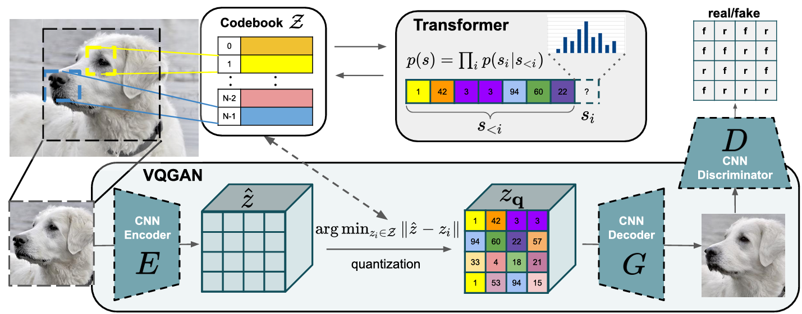
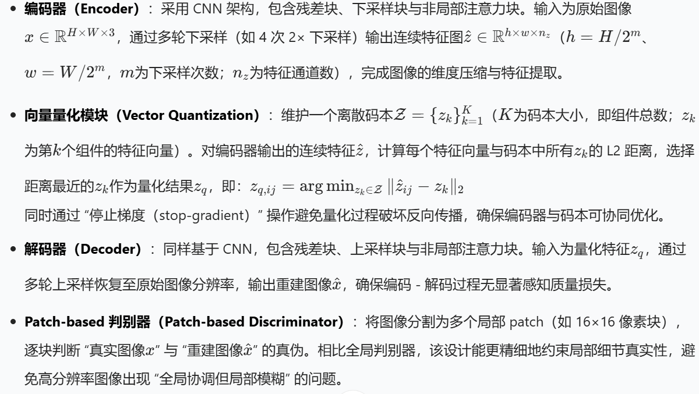
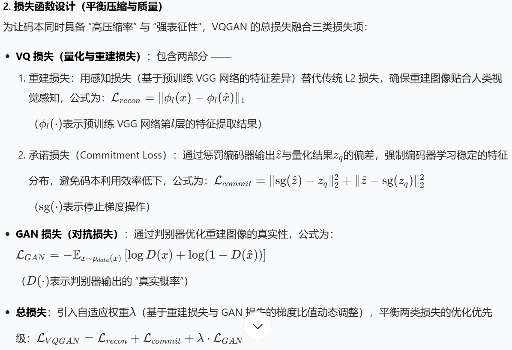

# 杂文
## Taming Transformers for High-Resolution Image Synthesis

实际干两件事：
1. 将图像通过VAE压到概率分布，然后将其量化。
2. 再用量化过后的值给Transformer使用。
### VQGAN
模型架构

损失

冻结是为了分别优化量化器和Encoder
### Transformer
做自回归任务，预测下一个量化值。
现在图像生成问题可以直接变为自回归问题。所以Transformer的loss可以直接用最大似然，即$L_{Transformer}=E_{x\sim p(x)}[-\log p(s)]$
对于额外条件下的生成，可以训练另外的VQGAN来将额外条件用码本表示，只需在s序列里加入新码本即可。