# GAN
## GAN（2014.06）
基本思想，有一个生成器，有一个判别器。让生成器和判别器进行对抗。
生成器目标:
$$\max_D D(x_i)=\max_D[\log D(x_i)]$$
$$\max_D [1-D(G(z_i))]=\max_D \{\log[1-D(G(z_i))]\}$$
判别器目标：
$$\min_G [1-D(G(z_i))]=\min_G \{\log[1-D(G(z_i))]\}$$
生成器合在一起：
$$\max_D\{\frac{1}{N}\sum_{i=1}^N\log D(x_i)+ \frac{1}{N}\sum_{i=1}^N\log[1-D(G(z_i))]\}$$
判别器：
$$\min_G \frac{1}{N}\sum_{i=1}^N \log[1-D(G(z_i))]$$
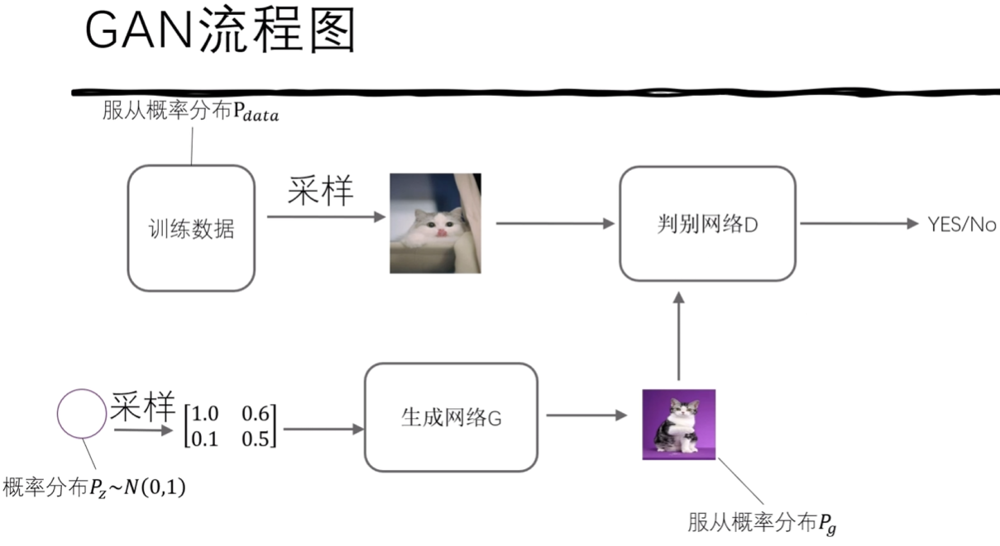
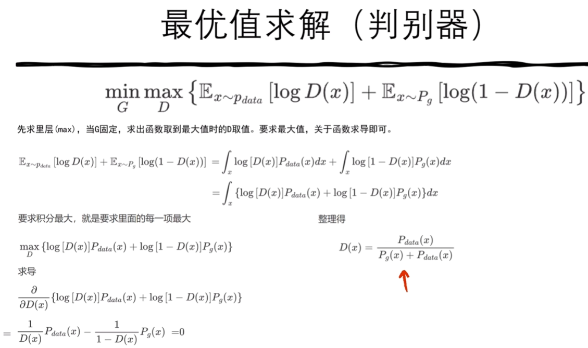
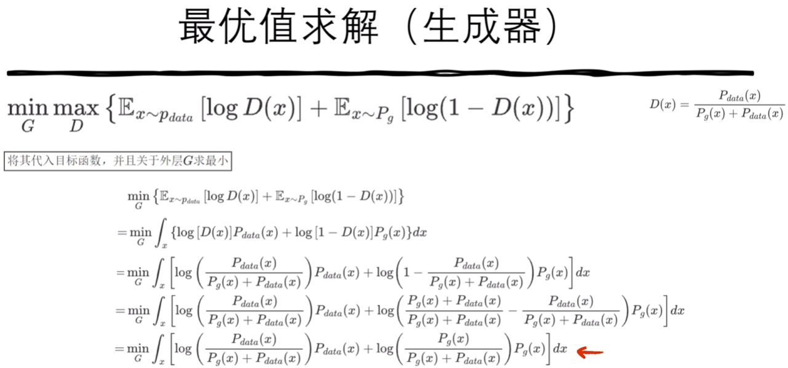
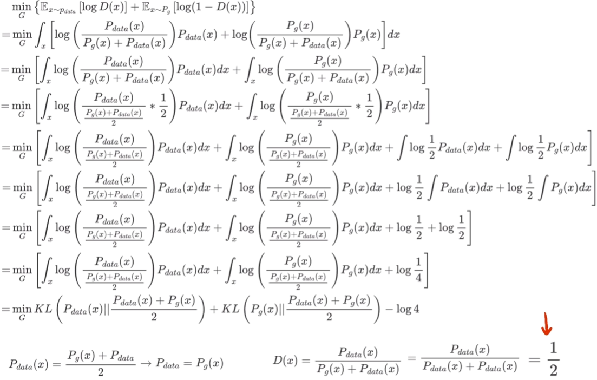

## VAE(2013.12)
将图像变成正态分布，再由正态分布变成图像的概率分布。
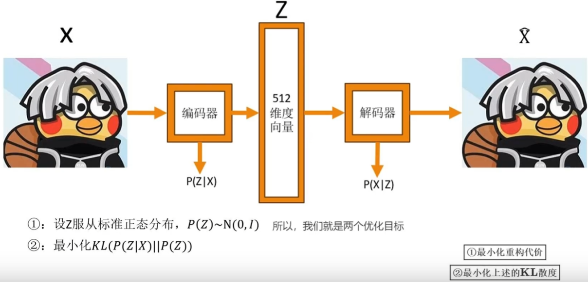
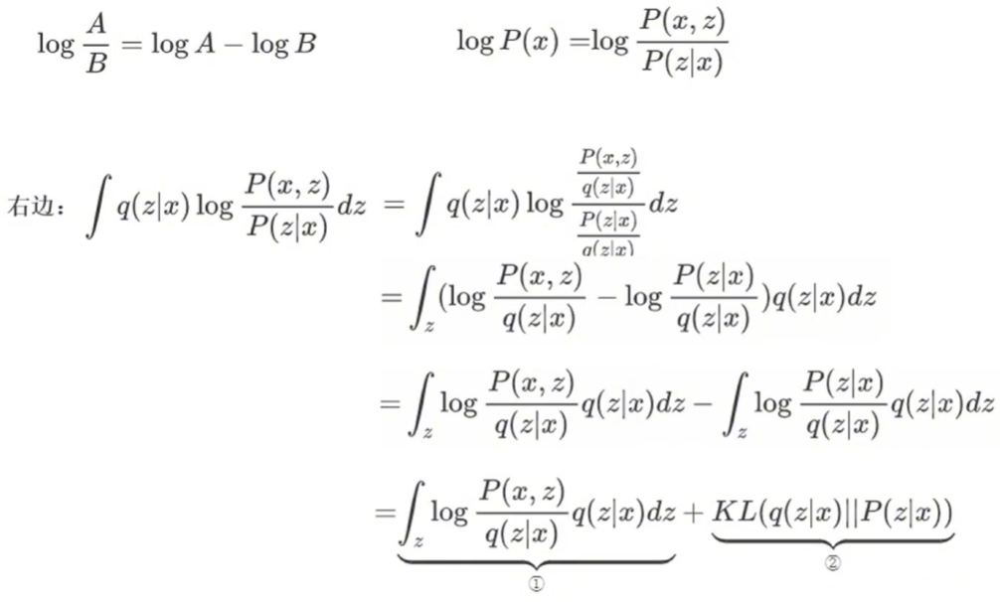
用极大似然估计$\theta$
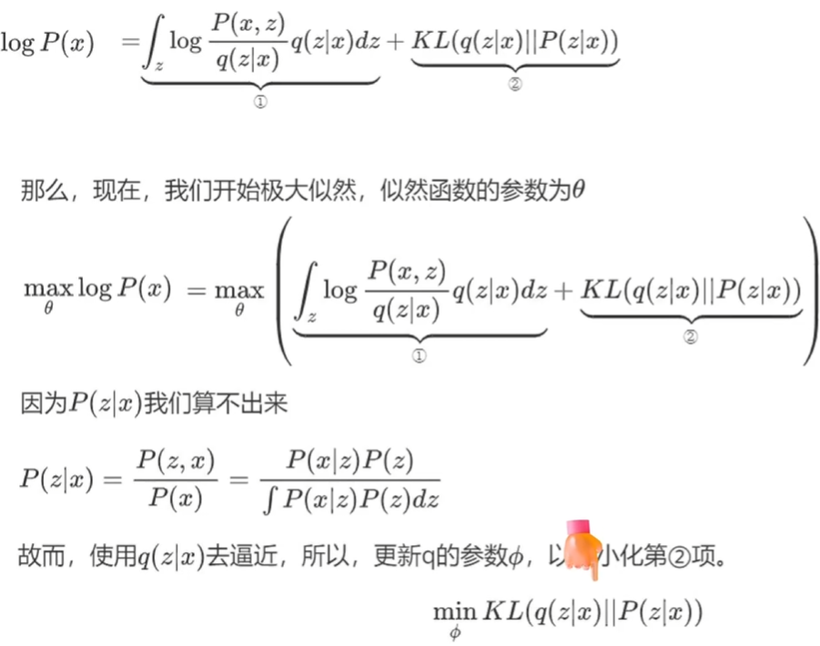
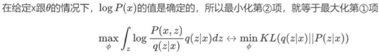
所以算法步骤如下：
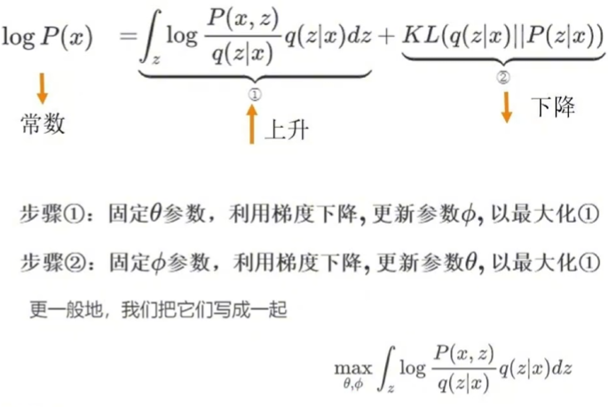
另一种理解：
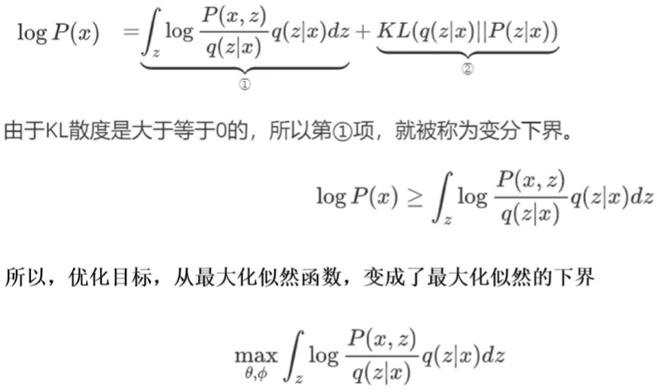
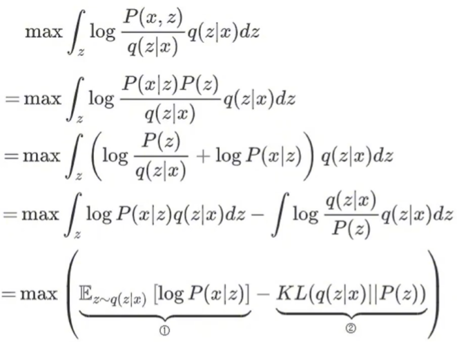
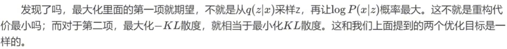
第一项：
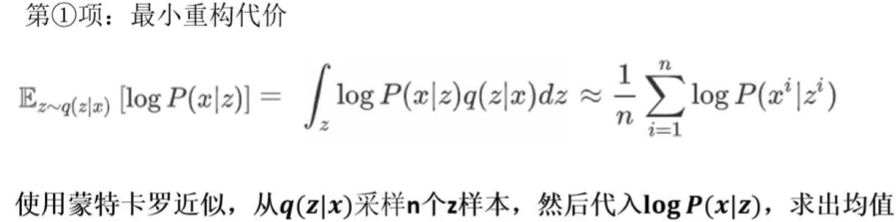
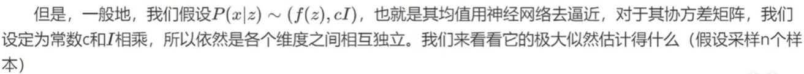
***注意是估计$P(x|z)$的分布，$f(z^i)$是网络还原的图像的均值，而不是网络中间估计出来的均值，网络中间的均值是$q(z|x)$的均值。***
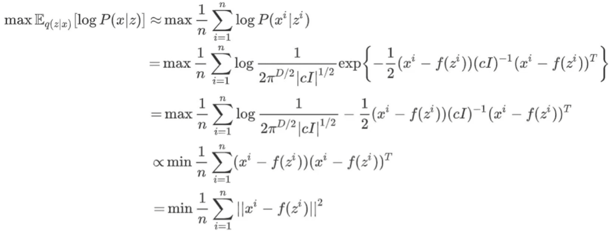
第二项：

总的损失为：
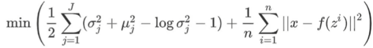
**注意$z$是多维度向量，认为每一维的分布都是标准正态，所以网络中间层估计的$\mu$是有多个的。**

### CVAE（条件VAE）
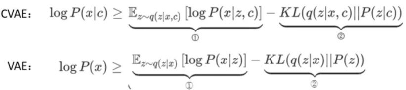

## DDPM