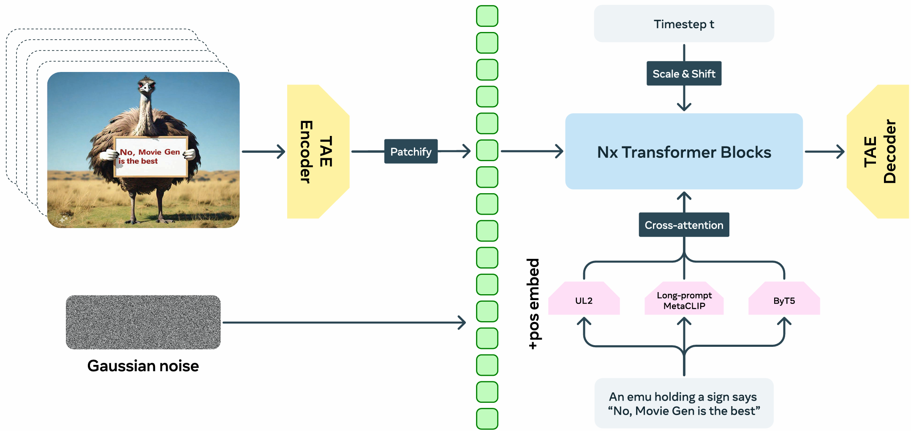
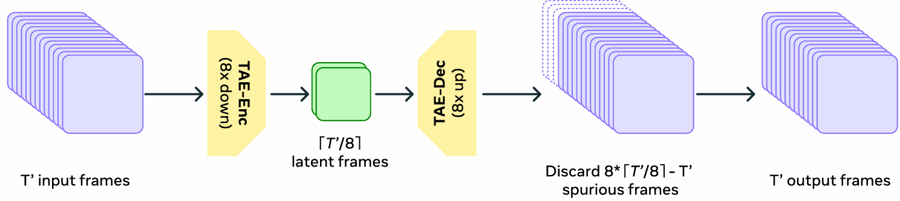
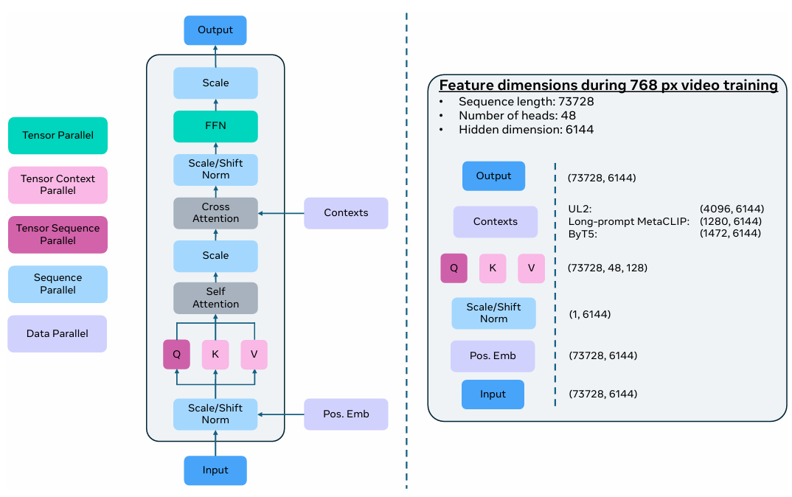
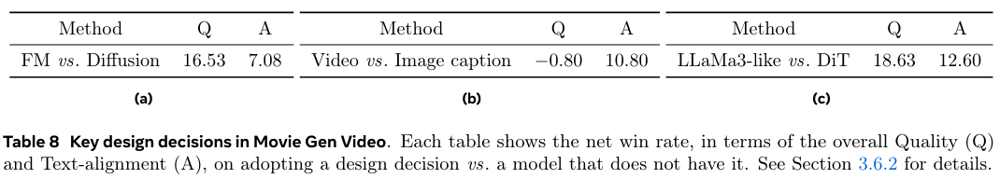
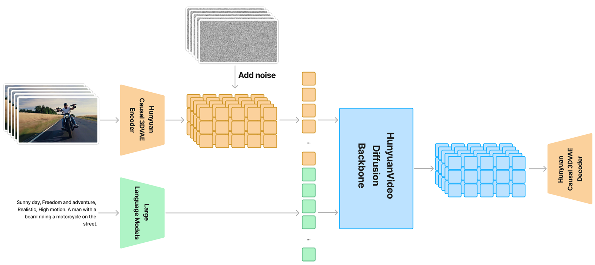
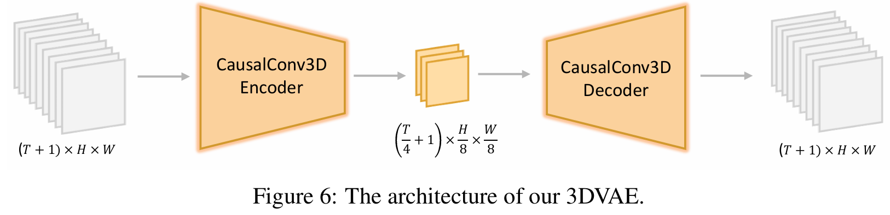
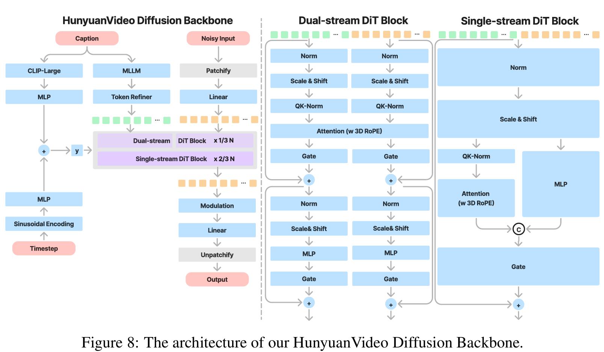

# 视频生成
## movieGen（2024.10）
### 数据准备
### 模型架构

先让视频过一个Encoder压缩到latent space，再打成patch去训练

借鉴VAE，VAE是2Dconv，视频压缩有两种常见，一种是3Dconv,一种是2Dconv+1Dconv,TAE用的是2Dconv+1Dconv，而混元Video用的是3Dconv。
**a 1D temporal convolution after each 2D spatial convolution and a 1D temporal attention after each spatial attention.**
训练的时候要求要兼容图像和视频。

文本编码使用了三个编码器concate，CLIP是用来与图像强相关，但CLIP是全局特征。用ByT5这种Byte级别的特征来辅佐生成文字（广告生成经常用这个），UL2一个串联了各种LLM编码器的编码器。
### Train
初始化用VAE参数
使用Flow Matching

## HunYuanVideo（2024.12）
### 模型架构

**Similar to previous work, we train a 3DVAE to compress pixel-space videos and images into a compact latent space. To handle both videos and images, we adopt CausalConv3D. For a video of shape $(T +1) ×3×H ×W$, our 3DVAE compresses it into latent features with shape$( \frac{T}{c_t} + 1) ×C ×(\frac{H}{c_s})×(\frac{W}{c_s})$. In our implementation, $c_t = 4, c_s = 8$, and $C = 16$.**
$T+1$是因为将第一帧单独处理，为了兼容图像和视频。
### Train
损失有几个：
1. $L_1$ reconstructive loss,真实图像和预测图像的$L_1$ loss。
2. VAE中间得到的特征并不是确定的值，而是潜在高斯分布的$\mu$和$\sigma^2$，$L_{KL}$是为了让潜在分布靠近标准高斯分布$N\sim(0,1)$。
3. $L_{lpips}$是感知损失，是将预测图片和真实图片经过类似CNN网络后得到的特征图进行比较，将像素级损失拓展到特征级损失。
4. $L_adv$是GAN网络的对抗损失。

$Loss=L_1+0.1L_{lpips}+0.05L_{adv}+10^{-6}L_{kl}$
初始化用随机参数（因为用的3Dconv，不用2Dconv的模型做初始化），先从低清视频然后训高清视频。
为了得到对high-motion的处理能力，合成了一些视频（对视频抽帧）。